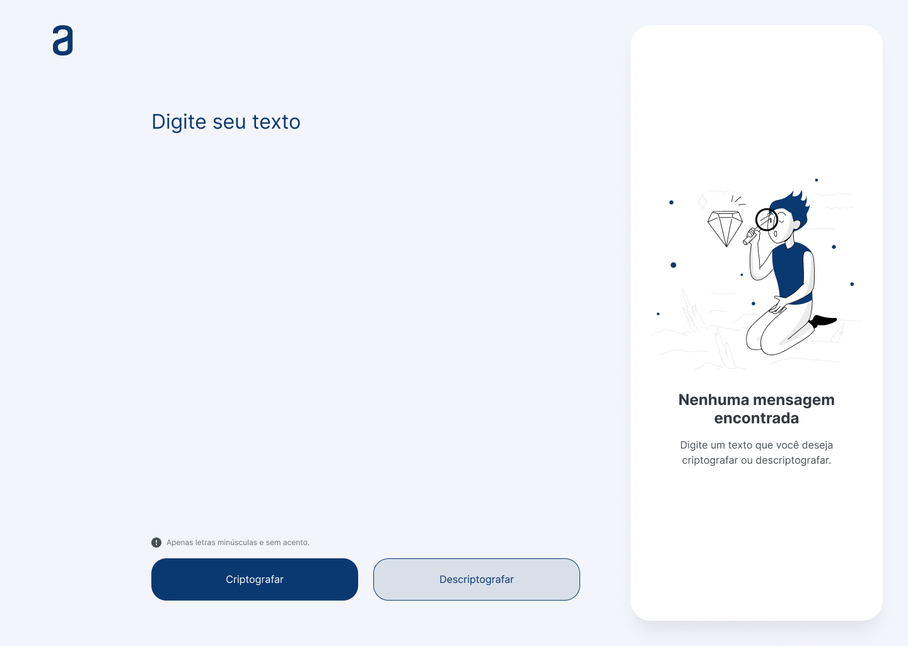
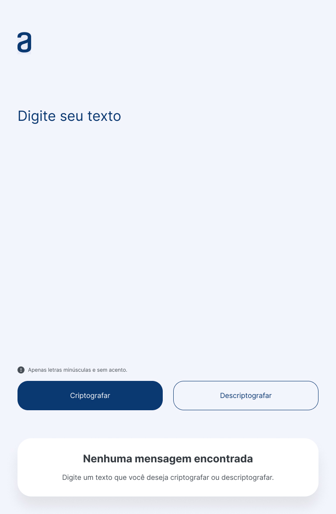
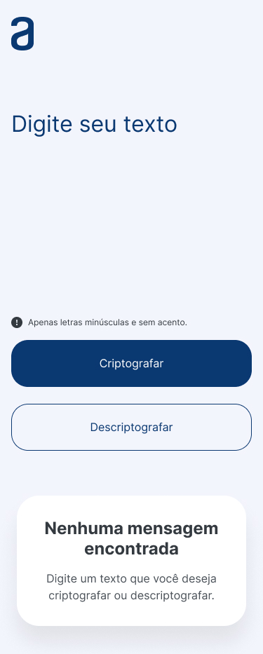
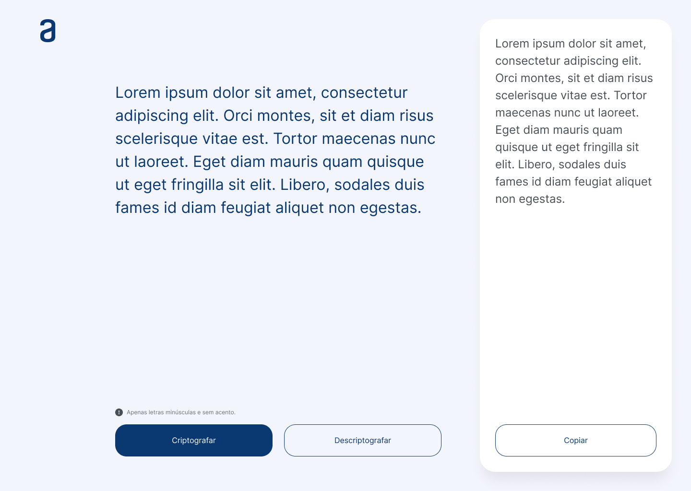
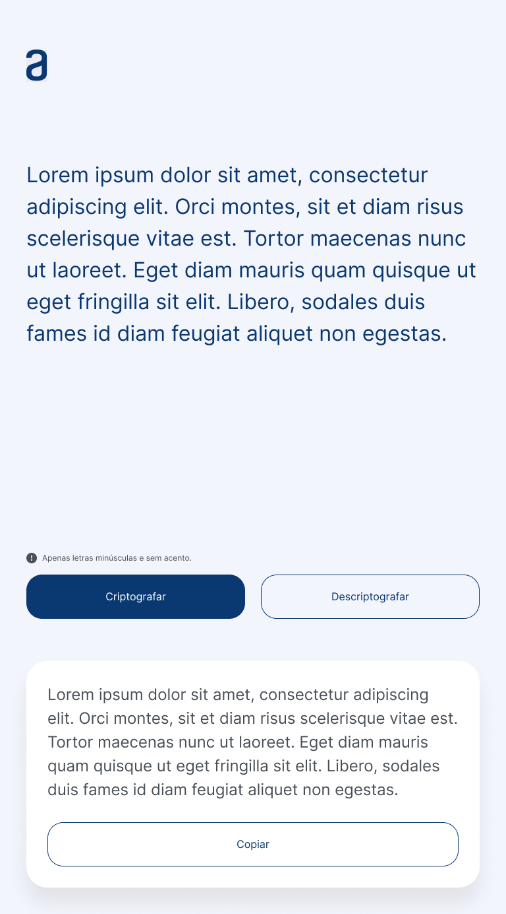
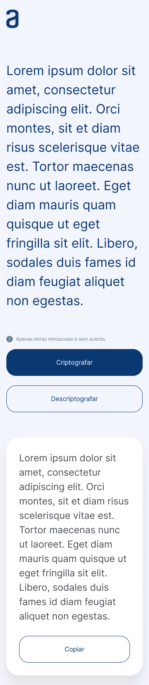

## 1 Challenge Iniciante em Programação

**Sobre o projeto**

Boas vindas ao primeiro desafio!

Durante estas duas semanas, vamos trabalhar em uma aplicação que criptografa textos, assim você poderá trocar mensagens secretas com outras pessoas que saibam o segredo da criptografia utilizada.

As "chaves" de criptografia que utilizaremos são:
A letra "e" é convertida para "enter"
A letra "i" é convertida para "imes"
A letra "a" é convertida para "ai"
A letra "o" é convertida para "ober"
A letra "u" é convertida para "ufat"

Requisitos:
- Deve funcionar apenas com letras minúsculas
- Não devem ser utilizados letras com acentos nem caracteres especiais
- Deve ser possível converter uma palavra para a versão criptografada e também retornar uma palavra criptografada para a versão original.

Por exemplo:
"gato" => "gaitober"
gaitober" => "gato"

A página deve ter campos para inserção do texto a ser criptografado ou descriptografado, e a pessoa usuária deve poder escolher entre as duas opções
O resultado deve ser exibido na tela.
Extras:
- Um botão que copie o texto criptografado/descriptografado para a área de transferência - ou seja, que tenha a mesma funcionalidade do ctrl+C ou da opção "copiar" do menu dos aplicativos.

Temos um período de tempo de quatro semanas para desenvolver o projeto e vamos trabalhar com o sistema ágil de desenvolvimento, utilizando o Trello da seguinte forma:

A coluna Pronto pra iniciar apresenta os cartões com os elementos ainda não desenvolvidos.
Já na coluna Desenvolvendo ficarão os elementos que você estiver desenvolvendo no momento. Ao iniciar uma tarefa, você poderá mover o cartão que contém a tarefa para esta coluna.
No Pausado estarão os elementos que você começou a desenvolver, mas precisou parar por algum motivo.
Por fim, a coluna Concluído terá os elementos já concluídos.
O Trello é uma ferramenta de uso individual para você controlar o andamento das suas atividades, mas ela não será avaliada.

**Bom projeto!!**

### Design

No projeto do Figma tem as informações necessárias para construir esse desafio.
Modelo proposto para a implementação deste desafio, lembre-se que você pode usar CSS para modificar cores e fontes, adicionar bordas e até fazer animações! Por exemplo:

-Alterar a fonte, tamanho e cor do título;
-Adicione uma cor, gradiente ou imagem como plano de fundo do seu site;
-Mude estilos, cores e bordas dos botões, explore sua criatividade ou você pode replicar exatamente o mesmo design apresentado, tudo ficará a seu critério.

### Estrutura da página

Elementos principais da página são Título do seu site, campo para o texto que vai ser criptografado/descriptografado, botões para fazer a criptografia/descriptografia
área para exibir o texto resultante.

E como **Extra**, um rodapé com os dados da pessoa que desenvolveu o site!

### Funcionalidade Extra

Essas atividades se referem ao desafio extra de adicionar um botão para copiar texto.

Se você tiver dificuldade em executar esta tarefa, os links a seguir podem te ajudar:

-[documentação de MDN](https://developer.mozilla.org/en-US/docs/Mozilla/Add-ons/WebExtensions/Interact_with_the_clipboard) sobre como copiar, cortar e colar dados na área de transferência usando JavaScript. Está em inglês, mas você pode usar o recurso do navegador para traduzir a página.
-[Clipboard API](https://developer.mozilla.org/en-US/docs/Web/API/Clipboard_API)

### Segredo

Descubra qual é a nossa mensagem secreta!

"pairaibenterns poberr enterncairair enterssenter dentersaifimesober enter tenterr fimesnailimeszaidober enterlenter coberm sufatcenterssober!"

### Telas

O desafio é para desenvolver um **Alura Challenge 1 - Decodificador de Texto** e a seguir temos as telas: 

- Tela 1 Desktop

   

 
- Tela 1 Tablet e Mobile

  
   
   

 

- Tela 2 Desktop

    

 
- Tela 2 Tablet e Mobile

  
   
   

 

### Gestão do projeto

- branch main com o projeto em produção
- branch challenge-1 com a versão do desafio
- uma branch para cada grupo de tarefas que gera valor

### Desenvolvimento do projeto

- [x] criar branch challenge-1
- [x] criar branch feature/html-css
- [x] Configurar vscode com Live Server
- [x] Estrutura html
- [x] favicon
- [x] Google Fonts: [Inter](https://fonts.google.com/specimen/Inter?query=inter)
- [x] Icon e Imagem
- [x] criar branch feature/js-logica

### Referências

Para te apoiar nesta tarefa, nós separamos para vocês alguns materiais de apoio:

Vídeos de resolução das principais partes do Challenge e repositório com o código.

- [Parte I - HTML e CSS](https://www.youtube.com/watch?v=04QvWw4aHlk), onde apresentamos a construção da estrutura com o HTML e uma parte da estilização com CSS. 

Tarefa desenvolvida na branch feature/html-css, mergeada na branch challenge-1 para validação, testes e aprovação para então mergeada na branch de produção main.

- [Parte II- Lógica com JavaScript](https://www.youtube.com/watch?v=e3PasHJMIF8), nele apresentamos o desenvolvimento das funções principais: codificar e decodificar o texto.

Tarefa desenvolvida na branch feature/js-logica, mergeada na branch challenge-1 para validação, testes e aprovação para então mergeada na branch de produção main.

As "chaves" de criptografia que utilizaremos são:
`A letra "e" é convertida para "enter"`
`A letra "i" é convertida para "imes"`
`A letra "a" é convertida para "ai"`
`A letra "o" é convertida para "ober"`
`A letra "u" é convertida para "ufat"`

- O [Challenge Decodificador](https://github.com/logica-programacion/Solucao-Challenge-Decodificador) e o [challenge one decodificador br](https://github.com/alura-challenges/challenge-one-decodificador-br) para que você possa fazer consultas e se inspirar para a construção do seu próprio código.

Bons estudos!

### Aperfeiçoamentos

- CSS
- [ ] utilizar variáveis para melhorar o código
- [ ] responsividade

- HTML
- [ ] revisar as tags semânticas
- [ ] nomes em inglês

- JS
- [ ] implementar a função para o botão copiar
- [ ] adicionar 1 funcionalidade
- [ ] criptografar o alfabeto inteiro
- [ ] criptografar os números

- **revisar em detalhes com o figma**

### Challenge ONE 1

E após de terminar o desenvolvimento do projeto desafio, ir até o formulário e preencher com as informações para garantir o cumprimento da tarefa.

[Instruções do Challenge ONE 1](https://www.alura.com.br/challenges/challenge-one-logica)
  - [Detalhes sobre esse challenge](https://www.alura.com.br/challenges/challenge-one-logica/sprint01-construa-decodificador-texto-com-javascript)
  - [Explicação sobre o challenge](https://www.youtube.com/watch?v=VwVC_bLcOGE)
  - [Trello do projeto as funcionalidades](https://trello.com/b/EmUFmjCv/decodificador-de-texto-alura-challenges-oracle-one)
  - [Figma do projeto](https://www.figma.com/file/tvFEYhVfZTjdJ5P24RGV21/Alura-Challenge---Desafio-1---L%C3%B3gica?node-id=16%3A802&mode=dev)
  - [Como dev usa Figma?](https://cursos.alura.com.br/extra/alura-mais/como-front-end-utiliza-o-figma-c858)
  - [Como colocar seu projeto no ar com o Github Pages?](https://www.alura.com.br/artigos/como-colocar-projeto-no-ar-com-github-pages)
  - [Começando com Git: Aprendendo a versionar](https://www.alura.com.br/artigos/comecando-com-git-aprendendo-versionar)
  - [Como colocar seu projeto no ar com o Github Pages?](https://www.alura.com.br/artigos/como-colocar-projeto-no-ar-com-github-pages)
  - [Entregar o decodificador de texto](https://lp.alura.com.br/alura-latam-entrega-challenge-one-portugues)

### Meu resultado

Realizado a publicação do projeto na url a seguir para testar usando o projeto [Text Decoder](https://douglasabnovato.github.io/text-decoder/).
