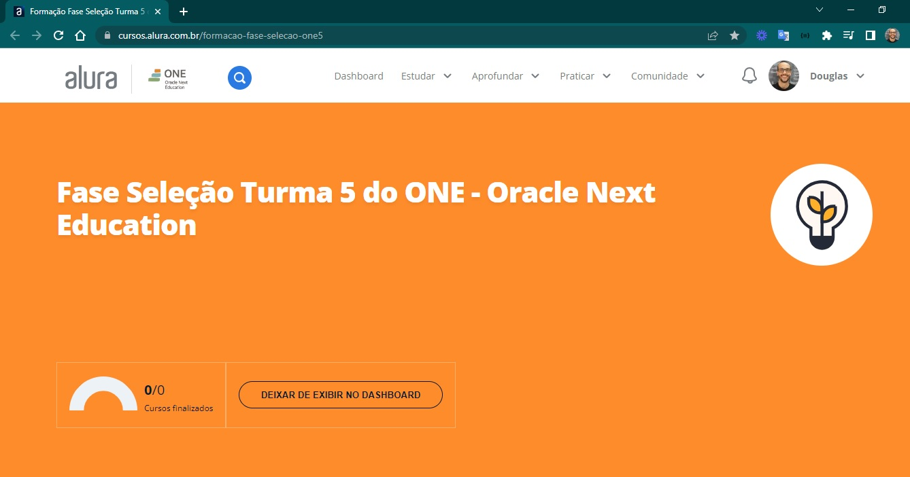

# Programa ONE

Programa ONE, Oracle Next Education, para formação de desenvolvedores da Alura em parceria com a Oracle.
Utiliza o Trello para organizar as tarefas para completar as etapas de conteúdos e projetos.

## [Fase Seleção Turma 5 do Oracle Next Education](https://cursos.alura.com.br/formacao-fase-selecao-one5)

Nessa fase de processo de seleção teremos que assistir a lives de esclarecimentos, trilha de conteúdos de desenvolvimento pessoal e cursos iniciantes de html, css e javascript.

   

 

Aqui acontece o primeiro contato com ferramentas de comunicação, discord, e ambiente de tecnologia, vscode, git, github. Além de gestão de projetos com trello. 

Gosto de destacar que o processo de organizar cronograma de conteúdo com prazos de entregas e aprender interagir com a comunidade para perguntar e responder é de grande aprendizado. 

## Formação Iniciante em Programação

- [x] 1. JavaScript e HTML: desenvolva um jogo e pratique lógica de programação
- [x] 2. JavaScript e HTML: pratique lógica com desenhos, animações e um jogo
- [x] 3. HTML5 e CSS3 parte 1: crie uma página da Web
- [x] 4. HTML5 e CSS3 parte 2: posicionamento, listas e navegação
- [x] 5. HTML5 e CSS3 parte 3: trabalhando com formulários e tabelas
- [x] 6. HTML5 e CSS3 parte 4: avançando no CSS
- [x] 7. Git e Github: controle e compartilhe seu código
- [x] 8. Challenges 
- [x] 9. Diagnóstico

## Formação Desenvolvimento Pessoal

- [x] 1. Aprender a aprender: técnicas para seu autodesenvolvimento
- [x] 2. LinkedIn: como fazer o seu perfil trabalhar para você
- [x] 3. Foco: trazendo mais resultados para o dia a dia
- [x] 4. Hábitos: da produtividade às metas pessoais 
- [x] 5. Diagnóstico